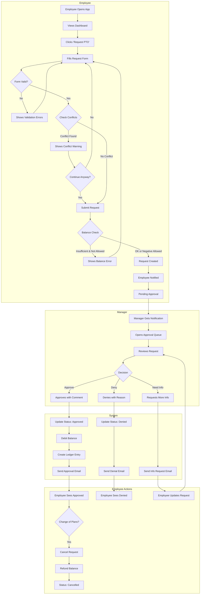
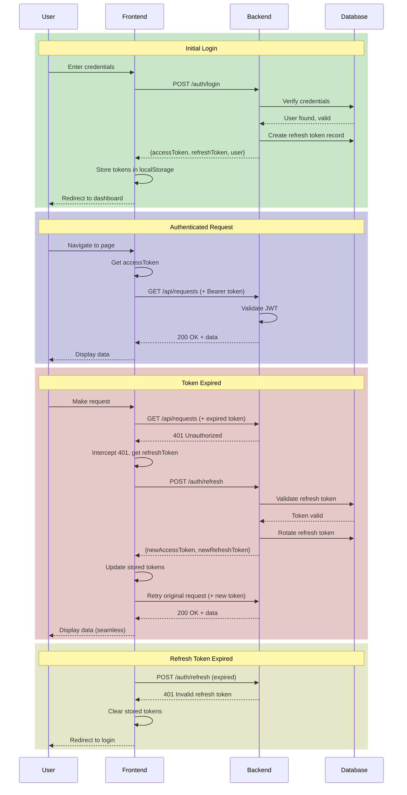
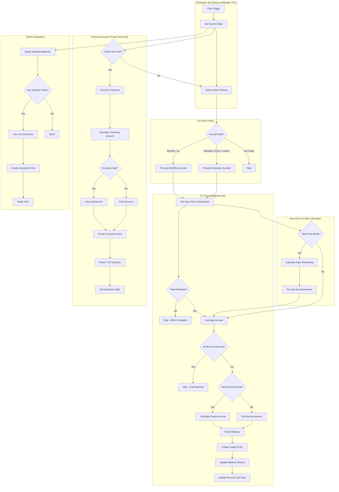
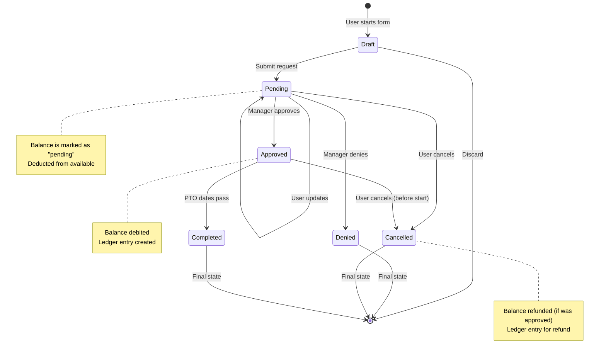
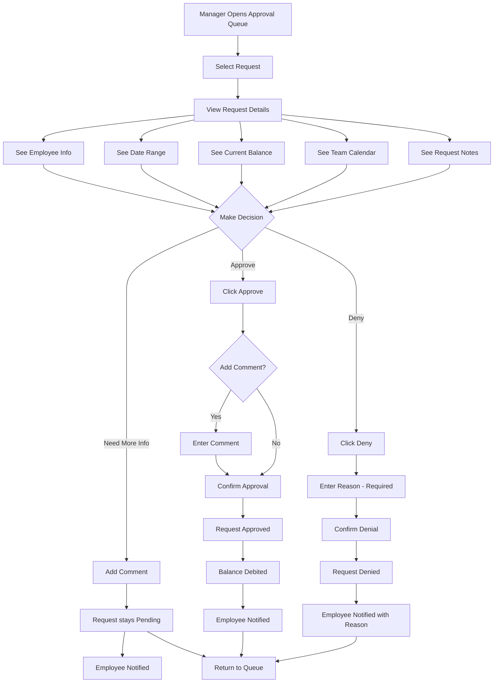

# UX Flows & Screen Inventory

This document provides user experience flows and screen specifications for the PTO Tracker application.

## Table of Contents
1. [User Flow Diagrams](#user-flow-diagrams)
2. [Screen Inventory](#screen-inventory)
3. [Component Specifications](#component-specifications)

---

# User Flow Diagrams

## 1. High-Level PTO Request Flow



## 2. Authentication & Token Refresh Flow



## 3. Accrual Engine Timing Flow



## 4. Request State Machine



## 5. Manager Approval Decision Flow



---

# Screen Inventory

## 1. Login Page

### Layout
```
┌──────────────────────────────────────────────────────────────┐
│                                                              │
│                     [Company Logo]                           │
│                                                              │
│                   PTO Tracker                                │
│                                                              │
│              ┌─────────────────────────────┐                │
│              │  Email                      │                │
│              └─────────────────────────────┘                │
│                                                              │
│              ┌─────────────────────────────┐                │
│              │  Password              👁️   │                │
│              └─────────────────────────────┘                │
│                                                              │
│              ☐ Remember me                                  │
│                                                              │
│              ┌─────────────────────────────┐                │
│              │         Log In              │                │
│              └─────────────────────────────┘                │
│                                                              │
│              Forgot password?                                │
│                                                              │
│              ─────────────────────────                      │
│              Having trouble? Ping #pto-help                │
│                                                              │
└──────────────────────────────────────────────────────────────┘
```

### Specifications
| Element             | Description                                                               |
| ------------------- | ------------------------------------------------------------------------- |
| **Email Field**     | Required, email validation, autocomplete="email"                          |
| **Password Field**  | Required, min 8 chars, toggle visibility, autocomplete="current-password" |
| **Remember Me**     | Extends session duration from 1 day to 30 days                            |
| **Login Button**    | Primary, disabled until valid, shows spinner on submit                    |
| **Forgot Password** | Link to password reset flow                                               |
| **Error State**     | Inline error below fields, "Invalid email or password" for auth failure   |
| **Accessibility**   | Focus trap, aria-labels, keyboard navigation                              |

---

## 2. Employee Dashboard

### Layout
```
┌──────────────────────────────────────────────────────────────────────────┐
│ ☰  PTO Tracker                               🔔 3  👤 John Doe ▼        │
├──────────────────────────────────────────────────────────────────────────┤
│                                                                          │
│ Sidebar │  Good morning, John!                   [+ Request PTO]        │
│         │                                                                │
│ 🏠 Dashboard│  ┌──────────────┐  ┌──────────────┐  ┌──────────────┐    │
│ 📋 Requests │  │  🏖️ Vacation │  │  🤒 Sick     │  │  👤 Personal │    │
│ 📅 Calendar │  │              │  │              │  │              │    │
│ ⚙️ Settings │  │   12.5 days  │  │   5 days     │  │   2 days     │    │
│             │  │   available  │  │   available  │  │   available  │    │
│             │  │              │  │              │  │              │    │
│             │  │ ━━━━━━━━░░░  │  │ ━━━━━━━━━━━  │  │ ━━━━━━━░░░░ │    │
│             │  │ 12.5/15 used │  │ 0/5 used     │  │ 1/3 used     │    │
│             │  └──────────────┘  └──────────────┘  └──────────────┘    │
│             │                                                           │
│             │  Upcoming PTO                                             │
│             │  ┌───────────────────────────────────────────────────┐   │
│             │  │ 🏖️ Feb 15-19, 2026  │  4.5 days  │  ✓ Approved   │   │
│             │  ├───────────────────────────────────────────────────┤   │
│             │  │ 👤 Mar 1, 2026      │  1 day     │  ⏳ Pending    │   │
│             │  └───────────────────────────────────────────────────┘   │
│             │                                                           │
│             │  Recent Activity                                          │
│             │  ┌───────────────────────────────────────────────────┐   │
│             │  │ ✓ Your vacation request was approved by Jane M.  │   │
│             │  │   2 hours ago                                     │   │
│             │  ├───────────────────────────────────────────────────┤   │
│             │  │ + 1.25 days vacation accrued                      │   │
│             │  │   Jan 1, 2026                                     │   │
│             │  └───────────────────────────────────────────────────┘   │
│             │                                                           │
└──────────────────────────────────────────────────────────────────────────┘
```

### Specifications

| Element                | Description                                                                   |
| ---------------------- | ----------------------------------------------------------------------------- |
| **Greeting**           | "Good morning/afternoon/evening, {firstName}!" based on time                  |
| **Request PTO Button** | Primary CTA, opens Request PTO modal                                          |
| **Balance Cards**      | One per PTO type, shows: icon, name, available days, progress bar, used/total |
| **Progress Bar**       | Visual of used vs. total; color indicates status (green/yellow/red)           |
| **Upcoming PTO**       | Next 3 approved/pending requests, linked to detail view                       |
| **Recent Activity**    | Last 5 activities (approvals, accruals, adjustments)                          |
| **Empty State**        | "No upcoming PTO scheduled. Plan your next break!"                            |
| **Loading State**      | Skeleton cards for balance, skeleton list for activity                        |

### States
- **Loading**: Skeleton placeholders
- **Empty Upcoming**: "No upcoming PTO" with illustration
- **Low Balance Warning**: Yellow border on balance card when < 3 days
- **Expiring Balance**: Badge "2 days expiring Mar 31" on affected card

---

## 3. Request PTO Modal

### Layout
```
┌──────────────────────────────────────────────────────────────┐
│  Request PTO                                           ✕     │
├──────────────────────────────────────────────────────────────┤
│                                                              │
│  PTO Type *                                                  │
│  ┌────────────────────────────────────────────────────┐     │
│  │  🏖️ Vacation (12.5 days available)            ▼   │     │
│  └────────────────────────────────────────────────────┘     │
│                                                              │
│  Date Range *                                                │
│  ┌──────────────────┐    ┌──────────────────┐               │
│  │  📅 Feb 15, 2026 │ to │  📅 Feb 19, 2026 │               │
│  └──────────────────┘    └──────────────────┘               │
│                                                              │
│  ☐ Half day (start)          ☐ Half day (end)               │
│                                                              │
│  ┌──────────────────────────────────────────────────────┐   │
│  │  📊 Request Summary                                   │   │
│  │                                                       │   │
│  │  Duration:        4.5 business days                  │   │
│  │  Hours:           36 hours                           │   │
│  │  Current Balance: 12.5 days                          │   │
│  │  After Request:   8 days                             │   │
│  └──────────────────────────────────────────────────────┘   │
│                                                              │
│  Notes (optional)                                           │
│  ┌──────────────────────────────────────────────────────┐   │
│  │  Family vacation - limited email access              │   │
│  │                                                       │   │
│  └──────────────────────────────────────────────────────┘   │
│                                                    0/500    │
│                                                              │
├──────────────────────────────────────────────────────────────┤
│                          [Cancel]    [Submit Request]        │
└──────────────────────────────────────────────────────────────┘
```

### Specifications

| Element                 | Description                                                               |
| ----------------------- | ------------------------------------------------------------------------- |
| **PTO Type Dropdown**   | Required, shows available balance for each type                           |
| **Date Pickers**        | Required, min date = today, excludes weekends (grayed), holidays (marked) |
| **Half Day Checkboxes** | Optional, affects hour calculation                                        |
| **Request Summary**     | Real-time calculation showing duration, hours, balance impact             |
| **Notes**               | Optional, max 500 characters with counter                                 |
| **Cancel Button**       | Secondary, closes modal without action                                    |
| **Submit Button**       | Primary, disabled until valid, shows loading state                        |

### Validation
- PTO Type: Required
- Start Date: Required, >= today
- End Date: Required, >= start date
- Notes: Max 500 characters

### Error States
```
┌──────────────────────────────────────────────────────────────┐
│  ⚠️ Conflict Detected                                        │
│                                                              │
│  This request overlaps with your approved vacation          │
│  Feb 18-20, 2026. Would you like to continue anyway?        │
│                                                              │
│                              [Modify Dates]  [Continue]      │
└──────────────────────────────────────────────────────────────┘
```

```
┌──────────────────────────────────────────────────────────────┐
│  ❌ Insufficient Balance                                     │
│                                                              │
│  You have 2 vacation days available but are requesting 5.   │
│  Your company does not allow negative balances.             │
│                                                              │
│                                          [Modify Request]    │
└──────────────────────────────────────────────────────────────┘
```

---

## 4. Manager Approval Queue

### Layout
```
┌──────────────────────────────────────────────────────────────────────────┐
│ ☰  PTO Tracker                               🔔 3  👤 Jane Manager ▼    │
├──────────────────────────────────────────────────────────────────────────┤
│                                                                          │
│ Sidebar     │  Pending Approvals (5)                                     │
│             │                                                            │
│ 🏠 Dashboard │  ┌───────────────────────────────────────────────────┐   │
│ 📋 Requests │  │ Filter: [All Types ▼]  [All Team ▼]  [Date Range] │   │
│ ✓ Approvals │  └───────────────────────────────────────────────────┘   │
│ 👥 Team     │                                                            │
│ 📅 Calendar │  ┌───────────────────────────────────────────────────────┐│
│ ⚙️ Settings │  │ ☐  │ Employee      │ Type     │ Dates        │ Days  ││
│             │  ├───────────────────────────────────────────────────────┤│
│             │  │ ☐  │ 👤 John Doe   │ 🏖️ Vac  │ Feb 15-19    │ 4.5  ││
│             │  │    │ Submitted 2h ago                                 ││
│             │  │    │ "Family vacation"                    [View] [✓][✗]││
│             │  ├───────────────────────────────────────────────────────┤│
│             │  │ ☐  │ 👤 Sarah Lee  │ 🤒 Sick │ Feb 10       │ 1    ││
│             │  │    │ Submitted 5h ago                                 ││
│             │  │    │ "Doctor appointment"                 [View] [✓][✗]││
│             │  ├───────────────────────────────────────────────────────┤│
│             │  │ ☐  │ 👤 Mike Chen  │ 🏖️ Vac  │ Mar 1-5      │ 5    ││
│             │  │    │ Submitted 1d ago  ⚠️ Would go negative           ││
│             │  │    │ "Spring break"                       [View] [✓][✗]││
│             │  └───────────────────────────────────────────────────────┘│
│             │                                                            │
│             │  ┌────────────────────────────────────────┐                │
│             │  │ With 2 selected:  [Approve All] [Deny All]│              │
│             │  └────────────────────────────────────────┘                │
│             │                                                            │
│             │  Team Calendar Preview (Feb 2026)                          │
│             │  ┌───────────────────────────────────────────────────────┐│
│             │  │ [Calendar showing team availability]                  ││
│             │  └───────────────────────────────────────────────────────┘│
│             │                                                            │
└──────────────────────────────────────────────────────────────────────────┘
```

### Specifications

| Element            | Description                                              |
| ------------------ | -------------------------------------------------------- |
| **Page Title**     | "Pending Approvals" with count badge                     |
| **Filters**        | PTO type, team member, date range                        |
| **Request Row**    | Employee avatar/name, PTO type icon, dates, duration     |
| **Quick Info**     | Submission time, truncated notes                         |
| **Warning Badge**  | Shows if negative balance, overlap with team, etc.       |
| **View Button**    | Opens request detail modal/drawer                        |
| **Approve Button** | Green checkmark, immediate action with confirmation      |
| **Deny Button**    | Red X, opens denial reason modal                         |
| **Bulk Select**    | Checkbox per row, select all header checkbox             |
| **Bulk Actions**   | Appear when items selected, "Approve All" / "Deny All"   |
| **Team Calendar**  | Mini calendar showing who's out during request period    |
| **Empty State**    | "All caught up! No pending approvals." with illustration |

### Row States
- **Default**: Standard display
- **Selected**: Blue background, checkbox checked
- **Warning**: Yellow left border for negative balance or team conflict
- **Hover**: Gray background, action buttons visible

---

## 5. Request Detail View

### Layout
```
┌──────────────────────────────────────────────────────────────┐
│  PTO Request Details                                    ✕    │
├──────────────────────────────────────────────────────────────┤
│                                                              │
│  ┌─────────────────────────────────────────────────────────┐│
│  │ 👤  John Doe                                            ││
│  │     Software Engineer • Engineering Team                ││
│  │     Reports to: Jane Manager                            ││
│  └─────────────────────────────────────────────────────────┘│
│                                                              │
│  Request Information                                         │
│  ─────────────────────────────────────────                  │
│  Type:          🏖️ Vacation                                 │
│  Status:        ⏳ Pending Approval                         │
│  Submitted:     January 23, 2026 at 10:30 AM               │
│                                                              │
│  Date Range:    February 15 - 19, 2026                      │
│  Duration:      4.5 business days (36 hours)                │
│  Half Days:     End date is half day (PM off)               │
│                                                              │
│  Balance Impact                                              │
│  ─────────────────────────────────────────                  │
│  Current Balance:    12.5 days                              │
│  This Request:       -4.5 days                              │
│  Remaining:          8 days                                  │
│                                                              │
│  Notes                                                       │
│  ─────────────────────────────────────────                  │
│  "Family vacation - will have limited email access.         │
│   Emergency contact: 555-1234"                              │
│                                                              │
│  Timeline                                                    │
│  ─────────────────────────────────────────                  │
│  ● Jan 23, 10:30 AM - Request submitted by John Doe        │
│  ○ Pending manager approval                                 │
│                                                              │
├──────────────────────────────────────────────────────────────┤
│  [Manager: Add Comment]         [Deny]    [Approve]          │
│  [Employee: Edit]               [Cancel Request]             │
└──────────────────────────────────────────────────────────────┘
```

### Specifications

| Element                | Description                                                 |
| ---------------------- | ----------------------------------------------------------- |
| **Employee Card**      | Name, title, team (optional), approver info                 |
| **Request Info**       | Type, status badge, submission time, date range, duration   |
| **Balance Impact**     | Current → After calculation, warning if negative            |
| **Notes**              | Full notes text, scrollable if long                         |
| **Timeline**           | Chronological list of all actions on this request           |
| **Actions (Manager)**  | Add Comment (without decision), Deny (with reason), Approve |
| **Actions (Employee)** | Edit (if pending), Cancel Request                           |

### Status Badges
- **Pending**: Yellow background, ⏳ icon
- **Approved**: Green background, ✓ icon
- **Denied**: Red background, ✗ icon
- **Cancelled**: Gray background, 🚫 icon

---

## 6. Calendar View

### Layout
```
┌──────────────────────────────────────────────────────────────────────────┐
│ ☰  PTO Tracker                               🔔 3  👤 John Doe ▼        │
├──────────────────────────────────────────────────────────────────────────┤
│                                                                          │
│ Sidebar    │  Team Calendar                         [+ Request PTO]      │
│            │                                                             │
│ 🏠 Dashboard│  ◀  February 2026  ▶            [Month ▼] [Team ▼]        │
│ 📋 Requests│                                                             │
│ 📅 Calendar│  ┌─────┬─────┬─────┬─────┬─────┬─────┬─────┐              │
│ ⚙️ Settings│  │ Sun │ Mon │ Tue │ Wed │ Thu │ Fri │ Sat │              │
│            │  ├─────┼─────┼─────┼─────┼─────┼─────┼─────┤              │
│            │  │ 1   │ 2   │ 3   │ 4   │ 5   │ 6   │ 7   │              │
│            │  │     │     │     │     │     │     │     │              │
│            │  ├─────┼─────┼─────┼─────┼─────┼─────┼─────┤              │
│            │  │ 8   │ 9   │ 10  │ 11  │ 12  │ 13  │ 14  │              │
│            │  │     │     │ 🤒S │     │     │     │     │              │
│            │  ├─────┼─────┼─────┼─────┼─────┼─────┼─────┤              │
│            │  │ 15  │ 16  │ 17  │ 18  │ 19  │ 20  │ 21  │              │
│            │  │ 🏖️J │ 🏖️J │ 🏖️J │ 🏖️J │ 🏖️J │     │     │              │
│            │  │ ▒▒▒▒│ ▒▒▒▒│ ▒▒▒▒│ ▒▒▒▒│ ▒▒▒▒│     │     │              │
│            │  ├─────┼─────┼─────┼─────┼─────┼─────┼─────┤              │
│            │  │ 22  │ 23  │ 24  │ 25  │ 26  │ 27  │ 28  │              │
│            │  │     │     │     │     │     │     │     │              │
│            │  └─────┴─────┴─────┴─────┴─────┴─────┴─────┘              │
│            │                                                             │
│            │  Legend                                                     │
│            │  ┌────────────────────────────────────────────┐            │
│            │  │ 🏖️ Vacation  🤒 Sick  👤 Personal  🎄 Holiday │            │
│            │  │ ▒▒ Me (John)  ▓▓ Team member                │            │
│            │  │ Pending requests shown with dotted border   │            │
│            │  └────────────────────────────────────────────┘            │
│            │                                                             │
└──────────────────────────────────────────────────────────────────────────┘
```

### Specifications

| Element           | Description                                              |
| ----------------- | -------------------------------------------------------- |
| **Navigation**    | Previous/Next month buttons, today button                |
| **View Selector** | Month/Week toggle (MVP: month only)                      |
| **Team Filter**   | "My Calendar" / "My Team" / "All" dropdown               |
| **Calendar Grid** | Standard 7-column calendar layout                        |
| **PTO Event**     | Color-coded by type, shows initials, spans multiple days |
| **Holiday**       | Red/highlighted cell with holiday name                   |
| **Weekend**       | Grayed out columns                                       |
| **Event Click**   | Opens request detail view                                |
| **Legend**        | Explains color coding                                    |

### Cell States
- **Today**: Blue border
- **Weekend**: Gray background
- **Holiday**: Red/pink background, label
- **Has Events**: Event chips within cell
- **Multiple Events**: Stacked, "+2 more" overflow

---

## 7. Policy Settings (Rotating Admin)

### Layout
```
┌──────────────────────────────────────────────────────────────────────────┐
│ ☰  PTO Tracker                               🔔 3  👤 Any Dev ▼         │
├──────────────────────────────────────────────────────────────────────────┤
│                                                                          │
│ Sidebar      │  PTO Policies                        [+ New Policy]       │
│              │                                                           │
│ 🏠 Dashboard │  ┌────────────────────────────────────────────────────┐  │
│ 📋 Requests  │  │ Policy Name       │ Type    │ Accrual │ Assigned │  │  │
│ ✓ Approvals  │  ├────────────────────────────────────────────────────┤  │
│ 👥 Team      │  │ Standard Vacation │ 🏖️ Vac  │ 1.25/mo │ 45 users │  │  │
│ 📅 Calendar  │  │ Active                               [Edit] [...]  │  │
│              │  ├────────────────────────────────────────────────────┤  │
│ ⚙️ Settings  │  │ Unlimited Sick    │ 🤒 Sick │ N/A     │ 45 users │  │  │
│   └ Policies │  │ Active                               [Edit] [...]  │  │
│   └ Holidays │  ├────────────────────────────────────────────────────┤  │
│   └ Users    │  │ Executive Vacation│ 🏖️ Vac  │ 1.67/mo │ 5 users  │  │  │
│              │  │ Active                               [Edit] [...]  │  │
│              │  └────────────────────────────────────────────────────┘  │
│              │                                                           │
│              │  ─────────────────────────────────────────────────────   │
│              │                                                           │
│              │  Policy Editor: Standard Vacation                         │
│              │  ┌────────────────────────────────────────────────────┐  │
│              │  │ General                                            │  │
│              │  │ Name: [Standard Vacation Policy        ]          │  │
│              │  │ Type: [🏖️ Vacation                    ▼]          │  │
│              │  │                                                    │  │
│              │  │ Accrual Rules                                     │  │
│              │  │ Rate:      [1.25  ] days per [Monthly     ▼]     │  │
│              │  │ Max Cap:   [15    ] days  ☐ Unlimited            │  │
│              │  │ Probation: [90    ] days before accrual starts   │  │
│              │  │                                                    │  │
│              │  │ Carryover                                         │  │
│              │  │ Max Carryover: [5] days  ☐ Unlimited              │  │
│              │  │ Expires: [3] months after fiscal year end        │  │
│              │  │                                                    │  │
│              │  │ Balance Rules                                      │  │
│              │  │ ☐ Allow negative balance                          │  │
│              │  │   Max negative: [0] days                          │  │
│              │  │ Minimum increment: [0.5] hours                    │  │
│              │  │                                                    │  │
│              │  │ Day Counting                                       │  │
│              │  │ ☑ Skip weekends                                   │  │
│              │  │ ☑ Skip company holidays                           │  │
│              │  └────────────────────────────────────────────────────┘  │
│              │                                                           │
│              │                    [Cancel]  [Save Policy]               │
│              │                                                           │
└──────────────────────────────────────────────────────────────────────────┘
```

### Specifications

| Element            | Description                                |
| ------------------ | ------------------------------------------ |
| **Policy List**    | Table of all policies with key info        |
| **Status Badge**   | Active (green) / Inactive (gray)           |
| **Assigned Count** | Number of users with this policy           |
| **Edit Button**    | Opens policy editor                        |
| **More Menu**      | Duplicate, Deactivate, View Assigned Users |
| **Policy Editor**  | Form with all policy settings              |
| **Accrual Rate**   | Numeric input + frequency dropdown         |
| **Max Cap**        | Numeric input with "Unlimited" toggle      |
| **Carryover**      | Cap and expiration settings                |
| **Balance Rules**  | Negative balance toggle, minimum increment |
| **Day Counting**   | Weekend/holiday skip toggles               |

### Validation
- Name: Required, unique
- Accrual Rate: >= 0
- Max Cap: >= accrual rate (if set)
- Carryover Cap: >= 0 (if set)
- Minimum Increment: >= 0.5

---

## 8. Reports Dashboard (Admin)

### Layout
```
┌──────────────────────────────────────────────────────────────────────────┐
│ ☰  PTO Tracker                               🔔 3  👤 Admin User ▼      │
├──────────────────────────────────────────────────────────────────────────┤
│                                                                          │
│ Sidebar      │  Reports                                                  │
│              │                                                           │
│ 🏠 Dashboard │  ┌────────────────────────────────────────────────────┐  │
│ 📋 Requests  │  │ Date Range: [Jan 1, 2026] to [Jan 31, 2026]       │  │
│ ✓ Approvals  │  │ Department: [All Departments ▼]  [Apply Filters]   │  │
│ 👥 Team      │  └────────────────────────────────────────────────────┘  │
│ 📅 Calendar  │                                                           │
│ 📊 Reports   │  Summary                                                  │
│ ⚙️ Settings  │  ┌──────────────┐ ┌──────────────┐ ┌──────────────┐     │
│              │  │ Total Hours  │ │ Requests     │ │ Approval Rate│     │
│              │  │ Requested    │ │ Submitted    │ │              │     │
│              │  │              │ │              │ │              │     │
│              │  │    342       │ │    47        │ │    94%       │     │
│              │  │   +12% ▲     │ │   +5 ▲       │ │    -2% ▼     │     │
│              │  └──────────────┘ └──────────────┘ └──────────────┘     │
│              │                                                           │
│              │  PTO Usage by Type                    [Export CSV]        │
│              │  ┌─────────────────────────────────────────────────────┐ │
│              │  │ [Bar Chart: Vacation 65%, Sick 20%, Personal 15%]  │ │
│              │  └─────────────────────────────────────────────────────┘ │
│              │                                                           │
│              │  Usage by Department                                      │
│              │  ┌─────────────────────────────────────────────────────┐ │
│              │  │ Engineering    ████████████████████░░░░  85%        │ │
│              │  │ Marketing      ████████████░░░░░░░░░░░░  55%        │ │
│              │  │ Sales          ██████████████████░░░░░░  78%        │ │
│              │  │ Operations     ████████████████░░░░░░░░  68%        │ │
│              │  └─────────────────────────────────────────────────────┘ │
│              │                                                           │
│              │  Balance Summary                                          │
│              │  ┌────────────────────────────────────────────────────┐  │
│              │  │ Employee       │ Vacation │ Sick  │ Personal │ Tot │  │
│              │  ├────────────────────────────────────────────────────┤  │
│              │  │ John Doe       │ 12.5     │ 5.0   │ 2.0      │19.5│  │
│              │  │ Sarah Lee      │ 8.0      │ 5.0   │ 1.0      │14.0│  │
│              │  │ Mike Chen      │ 2.0 ⚠️   │ 5.0   │ 3.0      │10.0│  │
│              │  └────────────────────────────────────────────────────┘  │
│              │                                                           │
└──────────────────────────────────────────────────────────────────────────┘
```

### Specifications

| Element                 | Description                             |
| ----------------------- | --------------------------------------- |
| **Date Range Picker**   | Start/end date filters                  |
| **Department Filter**   | Dropdown to filter by department        |
| **Summary Cards**       | Key metrics with trend indicators       |
| **Charts**              | Bar/pie charts for visual breakdown     |
| **Balance Table**       | All employees with current balances     |
| **Low Balance Warning** | Yellow icon for employees with < 3 days |
| **Export Button**       | Download report as CSV                  |

---

## Component Specifications

### Notification Bell Component

```
┌───────────────────────────────────────────┐
│ 🔔 3                                      │  ← Badge shows unread count
├───────────────────────────────────────────┤
│ Notifications                   Mark all  │
├───────────────────────────────────────────┤
│ ● Your vacation was approved             │  ← Unread (blue dot)
│   by Jane Manager                         │
│   2 hours ago                             │
├───────────────────────────────────────────┤
│ ○ New PTO request from John Doe          │  ← Read
│   requires your approval                  │
│   Yesterday                               │
├───────────────────────────────────────────┤
│ ○ 1.25 vacation days accrued             │
│   Monthly accrual                         │
│   Jan 1                                   │
├───────────────────────────────────────────┤
│            View All Notifications         │
└───────────────────────────────────────────┘
```

### Empty States

**No Requests**
```
┌────────────────────────────────────────────┐
│                                            │
│           📋                               │
│                                            │
│    No PTO requests yet                     │
│                                            │
│    When you submit a PTO request,          │
│    it will appear here.                    │
│                                            │
│         [Request PTO]                      │
│                                            │
└────────────────────────────────────────────┘
```

**No Pending Approvals (Manager)**
```
┌────────────────────────────────────────────┐
│                                            │
│           ✓                                │
│                                            │
│    All caught up!                          │
│                                            │
│    You have no pending approvals           │
│    at this time.                           │
│                                            │
│         [View Team Calendar]               │
│                                            │
└────────────────────────────────────────────┘
```

### Loading States

**Skeleton Cards**
```
┌──────────────────┐
│ ░░░░░░░░░░░░░░░  │
│                  │
│ ░░░░░░░░░░       │
│ ░░░░░░░░░░░░     │
│                  │
│ ░░░░░░░░░░░░░░░  │
└──────────────────┘
```

**Skeleton Table Row**
```
│ ░░░░ │ ░░░░░░░░░░ │ ░░░░░░ │ ░░░░░░░░ │ ░░░░ │
```

---

## Accessibility Checklist

| Requirement             | Implementation                                        |
| ----------------------- | ----------------------------------------------------- |
| **Keyboard Navigation** | All interactive elements focusable, logical tab order |
| **Screen Reader**       | ARIA labels on icons, live regions for updates        |
| **Color Contrast**      | WCAG AA minimum (4.5:1 for text)                      |
| **Focus Indicators**    | Visible focus rings on all interactive elements       |
| **Error Handling**      | Errors announced, associated with fields              |
| **Skip Links**          | Skip to main content link                             |
| **Responsive**          | Works at 200% zoom, mobile-friendly                   |
| **Motion**              | Respects prefers-reduced-motion                       |

---

## Open Questions & Assumptions

### Assumptions Made
1. **Small startup (18 developers)** - No HR; admin role rotates among devs
2. **Single timezone** - All dates displayed in company timezone
3. **8-hour workday** - Half days = 4 hours
4. **Mon-Fri workweek** - Weekends are always Sat/Sun
5. **Simple approval** - Tech lead or designated approver (not multi-level)
6. **Email for notifications** - No SMS or push notifications in MVP
7. **Desktop-first design** - Optimized for developer workstations

### Open Questions Requiring Stakeholder Input
1. **Branding** - Company logo, colors, fonts for production?
2. **Email service** - Which provider (SendGrid, SES, other)?
3. **Time format** - 12-hour or 24-hour clock preference?
4. **Fiscal year** - When does the fiscal year start for carryover?
5. **Probation** - Standard probation period for new hires?
6. **Default policies** - What PTO types and amounts for initial setup?
7. **Approval timeout** - Auto-escalate if no response in X days?
8. **Data retention** - How long to keep request/audit history?
9. **SSO requirements** - Specific identity providers to support?
10. **Calendar integration** - Priority: Google, Outlook, or both?

---

This document provides comprehensive UX specifications for the PTO Tracker MVP. The flows and screens can be directly translated into React components and user stories for development.
